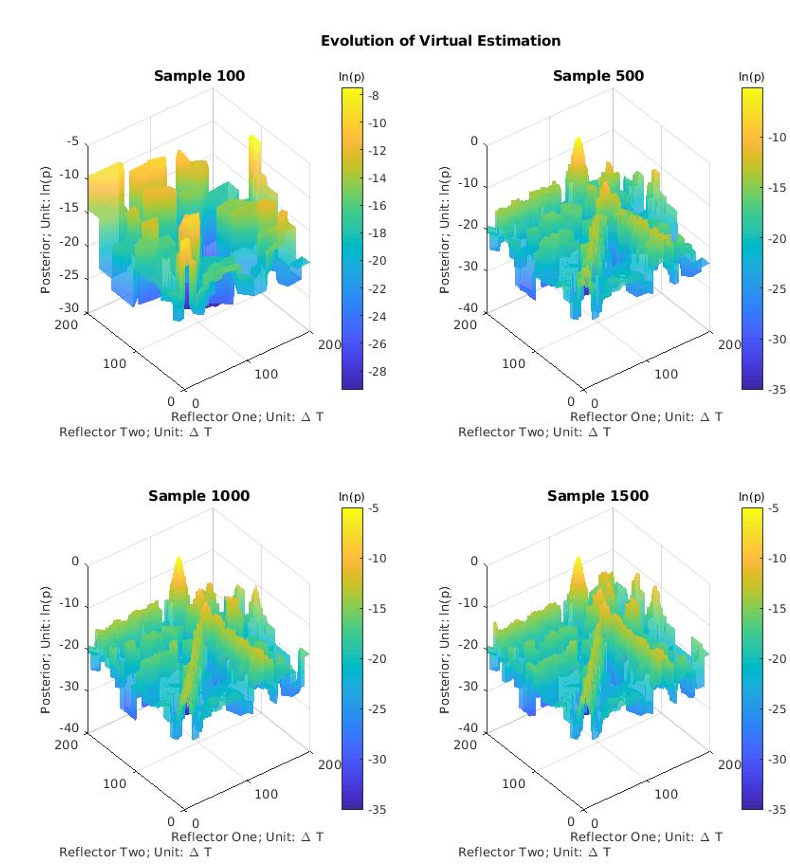
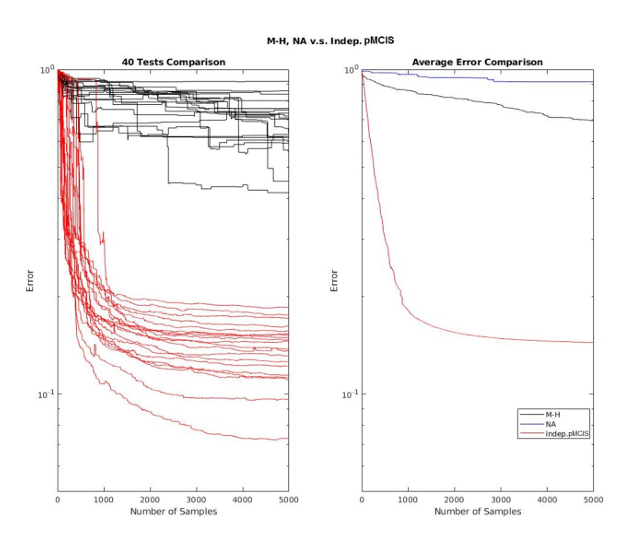

# Moving Target Monte Carlo: Independent Seismic Demo

This repository presents the published Moving Target Monte Carlo (MTMC) method
and a small synthetic seismic demonstration.

## Independent Reimplementation

This repository contains an independent educational and portfolio
reimplementation written from scratch in 2026 based solely on the publicly
available paper.

It does not contain source code, datasets, configuration files, or other
proprietary materials from ETH Zurich or the original research environment.
The code under `demo/` is not the original or official implementation used in
the research project.

Every input used by the demonstration is generated locally: the velocity
model, acquisition geometry, observations, and noise are all synthetic.

## Original research

The method was introduced in:

> Haoyun Ying, Keheng Mao, and Klaus Mosegaard. "Moving Target Monte Carlo."
> arXiv:2003.04873, 2020.

- Public paper page: [arXiv:2003.04873](https://arxiv.org/abs/2003.04873)
- Local archival copy: [2003.04873v1.pdf](2003.04873v1.pdf)
- Machine-readable citation: [CITATION.cff](CITATION.cff)

The paper citation, archived PDF, and thesis figures document the original
research. The new `demo/` implementation is deliberately separated from those
research artifacts.

## Public portfolio implementation

The independent demo uses a four-parameter synthetic velocity model and 68
straight source-receiver paths. It:

1. creates a rectangular velocity model entirely in memory;
2. generates source and receiver locations on the domain boundaries;
3. approximates straight-ray cell lengths with midpoint quadrature;
4. produces travel-time observations with seeded Gaussian noise;
5. constructs a Gaussian slowness posterior;
6. samples it with independent-proposal Metropolis-Hastings and MTMC; and
7. compares both sample means with the analytical linear-Gaussian posterior.

The problem is intentionally low-dimensional. This keeps the demonstration
easy to inspect and matches the regime in which a Voronoi nearest-neighbour
approximation is most attractive.

## MTMC idea

Conventional Metropolis-Hastings evaluates the true target at every proposed
state, including proposals that are rejected. MTMC instead maintains an
approximation built from all previously evaluated states. A proposal is tested
using that approximation, and the true target is evaluated only after the
proposal passes the preliminary test.

In the nearest-neighbour version, evaluated states are the sites of an implicit
Voronoi partition. A candidate inherits the true target value stored at its
nearest site. When a candidate is accepted, its true target value is evaluated
and appended to the archive, refining the probability-space reconstruction.

The independent implementation uses the same independent Gaussian proposal for
both samplers and retains the complete Hastings correction. Its logic follows
this non-executable outline:

```text
Evaluate the true target at the initial state and create the archive.

For each iteration:
    propose a candidate from the independent Gaussian proposal
    find the nearest evaluated state in the archive
    use that state's target value as the candidate approximation
    compute the preliminary acceptance ratio

    if the preliminary test accepts:
        evaluate the true target at the candidate
        move to the candidate
        add the evaluated candidate to the archive
    otherwise:
        keep the current state and leave the archive unchanged

    record the current state
```

Thus the true target is evaluated once at initialization and once for every
preliminarily accepted proposal. The conventional baseline evaluates it at
every iteration.

## Formation of the probability distribution



The figure illustrates probability-space reconstruction during sampling. With
few evaluated sites, the nearest-neighbour surface contains large constant
regions. Accepted evaluations divide those regions and progressively resolve
the target distribution's main structure. The panels show reconstruction of
the probability distribution, not merely a growing sample cloud.

## Low-dimensional performance



In low dimensions, a modest archive can cover the important parts of parameter
space while nearest-neighbour lookup remains inexpensive. This is the intended
regime for the minimal demo: the true target represents the expensive step,
and the reconstructed surface screens proposals before that calculation.

## High-dimensional limitation

The same Voronoi mechanism becomes less effective as dimension increases.
Evaluated sites become sparse relative to the growing volume, nearest sites can
be far from candidates, and many more evaluations are required to represent
the probability surface. Explicit Voronoi connectivity can also become costly;
implicit nearest-neighbour lookup avoids constructing the cells but does not
remove the coverage and search-cost problem.

MTMC is therefore most compelling for suitable low-dimensional problems with
expensive target evaluations. This repository does not present it as a
universal replacement for high-dimensional samplers.

## Install and run

Python 3.10 or newer is recommended.

```powershell
python -m venv .venv
.\.venv\Scripts\Activate.ps1
python -m pip install --upgrade pip
python -m pip install -r requirements.txt
python -m demo.run_demo
```

For a short deterministic run without plotting:

```powershell
python -m demo.run_demo --steps 800 --burn-in 200 --no-plot
```

Generated metrics, samples, and plots are written to `outputs/synthetic_demo/`
and are excluded from version control.

With the default seed and 12,000 recorded states, the verified reference run
used 12,000 true target evaluations for conventional Metropolis-Hastings and
1,644 for MTMC. Both posterior velocity means were within 1 m/s RMSE of the
analytical posterior mean in that run. The synthetic target is deliberately
cheap, so the evaluation count demonstrates the algorithmic difference more
meaningfully than local wall-clock timing.

Run the tests with:

```powershell
python -m unittest discover -s demo/tests -v
```

## Repository contents

```text
2003.04873v1.pdf              Archival copy of the public paper
pic/formation.png             Thesis probability-reconstruction figure
pic/result.png                Thesis low-dimensional comparison figure
demo/forward_model.py         Independent midpoint straight-ray calculation
demo/synthetic_model.py       Synthetic observations and Gaussian posterior
demo/metropolis.py            Conventional Metropolis-Hastings baseline
demo/proposals.py             Proposal kernels and Hastings corrections
demo/mtmc_reimplementation.py Independent nearest-neighbour MTMC
demo/run_demo.py              Reproducible command-line experiment
demo/tests/                    Deterministic unit tests
```

## Citation

```bibtex
@article{ying2020moving,
  title         = {Moving Target Monte Carlo},
  author        = {Ying, Haoyun and Mao, Keheng and Mosegaard, Klaus},
  year          = {2020},
  eprint        = {2003.04873},
  archivePrefix = {arXiv},
  primaryClass  = {stat.CO}
}
```

## Rights

Copyright (c) 2026 Keheng Mao. All rights reserved.

No open-source software license is currently granted for the independent demo.
Reuse of the paper and figures remains subject to their applicable publication
and copyright terms.
